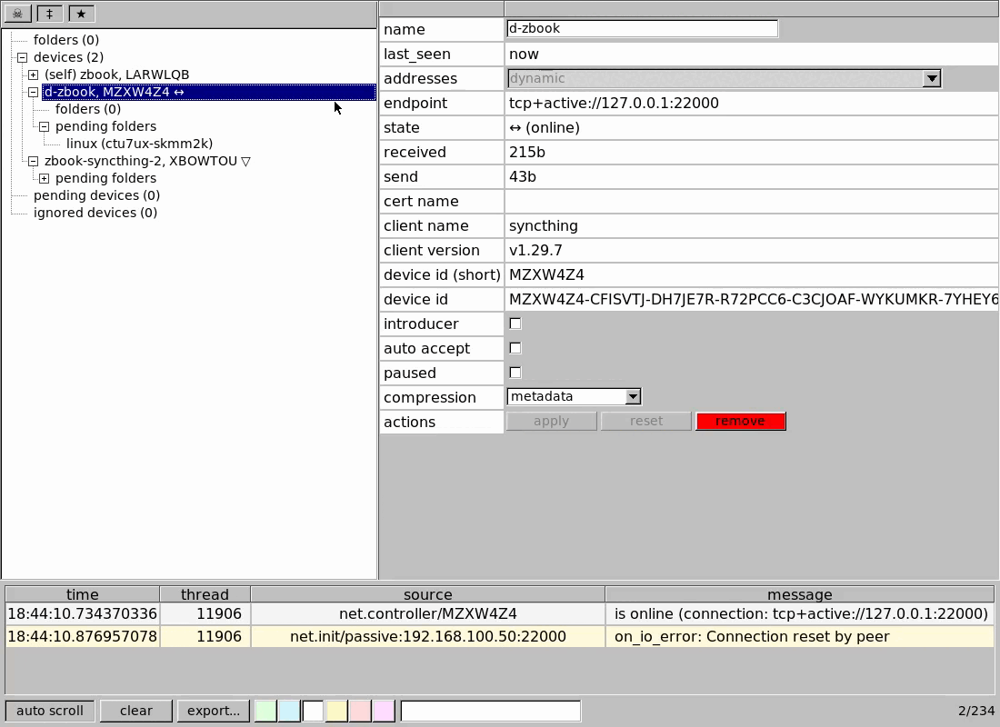
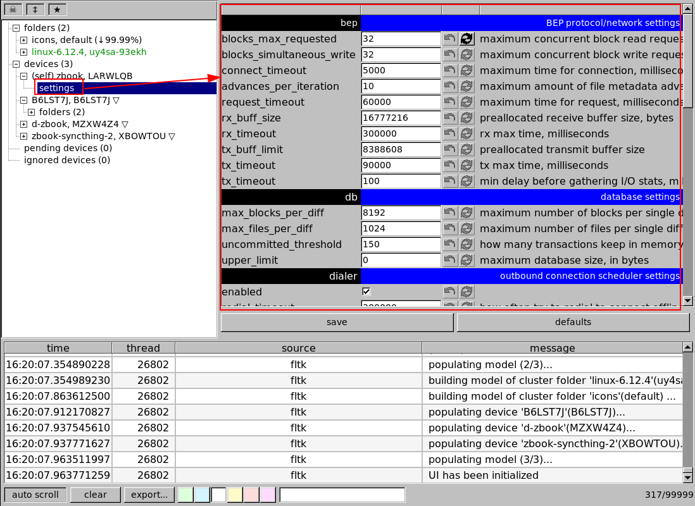
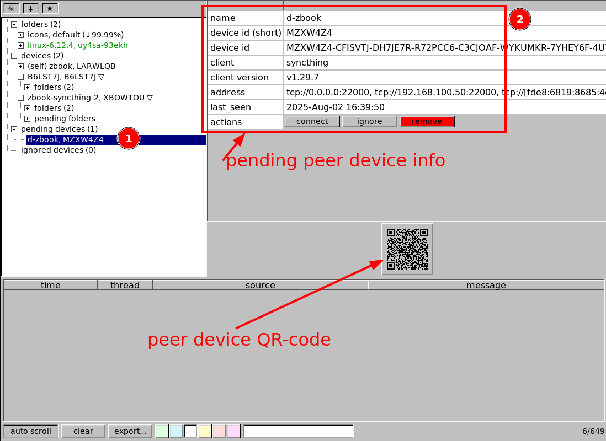
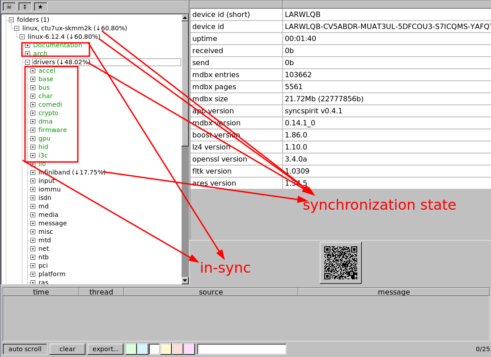
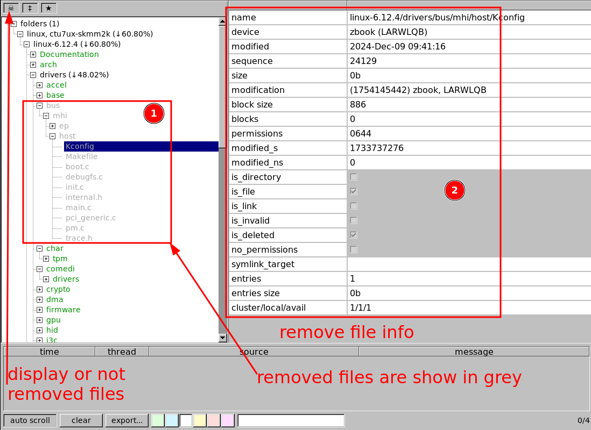
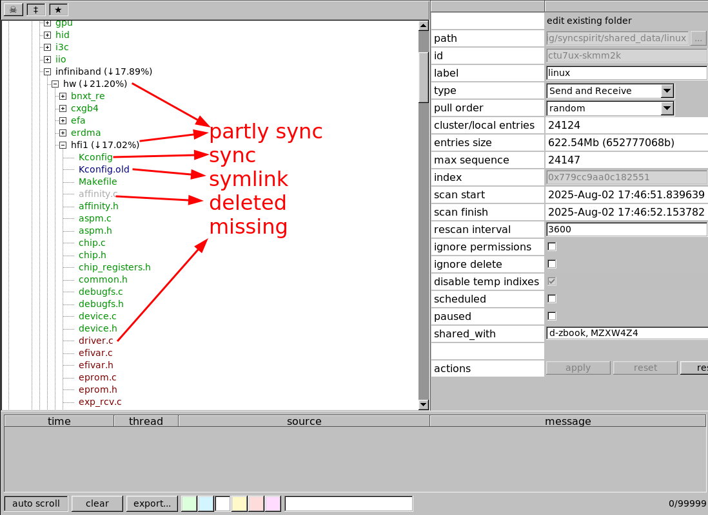

# ui-fltk

## overview

`syncspirit` fltk-frontend (aka fltk-ui) is based on cross-platform
[fltk](https://www.fltk.org/) toolkit.

The source compiles for linux, windows and mac os X platforms, the binaries
are available for linux and windows only.

On the first launch the database is initialized, local device id is generated
(i.e. cryptographical keys). The local device id can be copied to clipboard
for sharing or it can be fetched from the generated QR-code.

The settings can be edited by expanding the local device (self) node
and selecting` settings` node. The settings have reasonable defaults applicable
for the most of uses.  The application restart is requite to let  the changed
settings take effect.

Alternatively, the settings can be edited via `$HOME/.config/syncspirit/syncspirit.toml`
file in toml-format.

The settings (aka `syncspirit.toml`) are shared across all `syncspirit` UIs
on the host.

To add peer device click on "devices" node and enter peer device id and its
label.

Alternatively, if peer device already knows local device and tries to connect,
it will be disconnected but appear in "pending devices" list.

When peer device is connected (trusted), then some peer settings can be edited
(not all of them are implemented). When trusted peer connected to our device
at least once the shared with us folders appear on a tree (pending folders node).

Click on a pending folder to be shared with peer. Edit its label and local
path where its files will be stored. There are other folder settings, not all
of them are implemented.

There is a special folder sharing option: "scheduled" . When this option is
enabled, the files from the folder are not downloaded from peer, instead
they (their metadata) just can be seen. This is implemented for asked
"selective sync" feature.

Shared with peer folder can be browsed (actually metadata only, not content).
It does not depend whether the folder is "scheduled" or not. However if folder
is "paused", peer does not send folder updates, so it can be outdated.

Shared with peer folder can be browsed even if peer device is offline.

When folder is synchronizing it is indicated by special icon. Some other folder
settings can be adjusted here.

Local files can be browsed, even when synchronization is in progress.

When browsing local and remote files the removed files can be also seen,
including the possibility to see the file history and determine the device
which deleted it.

By default removed files are not displayed.

It is possible to determine file state from its color: missing (not yet downloaded),
deleted, partly-sync and its percentage (for folders) and symlink.

The peer folder information reflects global folder state too, i.e. it shows
deleted, actual and outdated files.

## bug reporting

1. launch the application with `--log_level trace`

2. the attach the log file `syncspirit-bootstrap.log` to bug description

